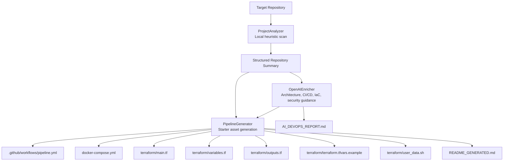

# AI DevOps Agent

`ai_devops_agent.py` is a single-mode DevOps analysis and asset-generation tool. It scans a repository locally, sends the structured scan to OpenAI for deeper DevOps guidance, and produces a report plus starter delivery artifacts.

## What It Does

- Detects likely frontend and backend stacks across the repository
- Reviews Docker, Terraform, and GitHub Actions signals
- Highlights workflow, security, and infrastructure gaps
- Uses OpenAI to enrich the local scan with architecture and DevOps guidance
- Generates starter delivery assets for CI/CD, local orchestration, and AWS EC2 deployment

## Architecture



## Execution Flow

1. `ProjectAnalyzer` scans the repository and builds a deterministic summary.
2. `OpenAIEnricher` sends that summary to OpenAI for richer DevOps analysis.
3. `AIDevOpsAgent` writes `AI_DEVOPS_REPORT.md`.
4. `PipelineGenerator` creates starter workflow, Docker Compose, Terraform, and generated README assets.

## Requirements

- Python 3.9+
- `OPENAI_API_TOKEN` environment variable, or `--openai-token`

Install dependencies:

```bash
python -m pip install -r requirements.txt
```

## Usage

The only supported mode is `ai`:

```bash
python ai_devops_agent.py --mode ai
```

Common examples:

```bash
python ai_devops_agent.py --project-root /path/to/repo --mode ai
python ai_devops_agent.py --config-file pipeline_request.txt --mode ai
python ai_devops_agent.py --openai-model gpt-5.4-mini --mode ai
```

If `--openai-token` is not passed, the agent reads `OPENAI_API_TOKEN`.

## Configuration

`pipeline_request.txt` is optional. If present, the generator reads simple `key: value` pairs such as:

```txt
pipeline_name: example-service-ai-pipeline
target: aws_ec2
app_image_repository: ghcr.io/example-org/example-app
environment: production
instance_type: t3.micro
app_image_tag: latest
database_engine: postgres
```

Supported keys:

- `pipeline_name`
- `target`
- `environment`
- `instance_type`
- `database_engine`
- `app_image_repository`
- `app_image_tag`

Defaults are applied when the file is missing.

See [templates/pipeline_request.txt.example](templates/pipeline_request.txt.example) for a working example.

## Generated Outputs

The run can generate:

- `AI_DEVOPS_REPORT.md`
- `.github/workflows/pipeline.yml`
- `docker-compose.yml`
- `terraform/main.tf`
- `terraform/variables.tf`
- `terraform/outputs.tf`
- `terraform/terraform.tfvars.example`
- `terraform/user_data.sh`
- `README_GENERATED.md`

Depending on the selected database engine, it may also create database init scripts under `docker/init/`.

## AI Enrichment

The OpenAI step enriches the local scan with:

- executive summary
- architecture summary
- frontend assessment
- backend assessment
- IaC recommendations
- workflow review
- security priorities
- quick wins
- long-term improvements
- generated asset guidance

The default model is `gpt-5.4-mini`, configurable with `--openai-model`.

## GitHub Actions Template

Use the template at [templates/github-actions/ai-devops-agent-template.yml](templates/github-actions/ai-devops-agent-template.yml).

The template:

- checks out the target repository
- checks out this agent repository as a tool dependency
- installs Python dependencies
- provides `OPENAI_API_TOKEN`
- runs `python ai_devops_agent.py --mode ai`
- uploads `AI_DEVOPS_REPORT.md` and generated assets

## Notes

- Repository detection is heuristic; AI guidance improves the analysis but does not replace repo-specific review.
- Generated workflows, Compose files, and Terraform are starter assets and should be reviewed before production use.
- Server-rendered HTML apps inside Spring Boot projects are treated as frontend surfaces even when they live with the backend.

## Docs

- [Implementation Guide](docs/IMPLEMENTATION_GUIDE.md)
- [Pipeline Request Example](templates/pipeline_request.txt.example)
